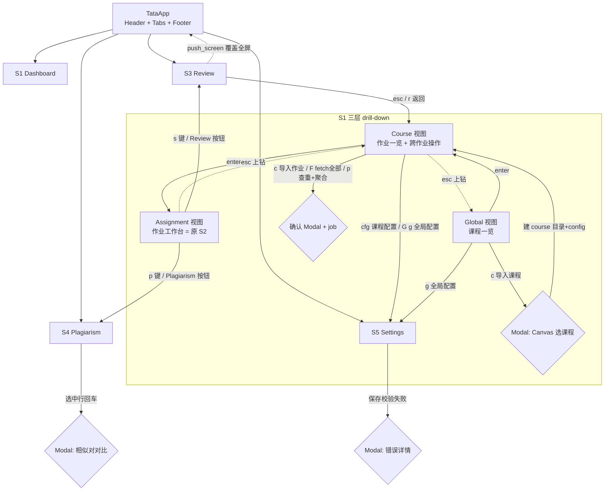

# TATA 设计稿 v1.1 — 00 · 信息架构（IA）

> 状态：v1.1 候选稿（多课程支持） ｜ 读者：实现工程师 ｜ 范围：TATA Textual TUI 平台的导航结构、屏幕清单、共享状态
> 依据源码：`main.py`（`_STAGES` 注册表、各 stage 纯函数）、`src/score_review.py`（既有 Viewer App）、`src/assignment_config.py`（config 分层模型）、`data/config.toml`（迁移后=global 根配置样例）
> v1.1 变更：Dashboard 三层导航（Global/Course/Assignment）、目录插入 course 层、原 S2 Pipeline Tab 并入 S1 第三层；**UI 文案全英文（用户 2026-08-29 确认：中文渲染可能有风险）**；Global 层跨课程查重

---

## 1. 产品定位与目标

把 TATA 从「一串 CLI 子命令」变成「一站式 Textual TUI 工作台」：
用户不离开 TUI 即可完成 **导入 → fetch → preprocess → grade → score → review → plagiarism** 全闭环。

**非目标（v1 明确不做）：**
- 不在 TUI 内编辑 rubric / system prompt 文件内容（只提供路径编辑与打开——用 `$EDITOR` 放行）
- 不做多用户/远程协作；不做评分重打回写 Canvas（v1 只读审查）
- 不做真实时绘图（用统计行+徽章代替，YAGNI）

## 2. 屏幕清单（4 屏 + 1 弹栈，多课程三层）

| # | 屏幕 | 职责 | 对应 CLI 子命令 |
|---|------|------|----------------|
| S1 | Dashboard（三层） | **Global**：课程一览 + 导入课程 + 全局配置 + 跨课程查重 ｜ **Course**：课程作业一览 + 导入作业/fetch 全部/查重+聚合/课程配置 ｜ **Assignment**：单作业工作台（原 S2，含 pipeline 全 stage） | `fetch`、`plagiarism --aggregate [--cross-course]`、`list_courses/list_assignments` |
| S2 | ~~Pipeline~~ → 已并入 S1.Assignment | 单作业工作台（原 S1 第三层；设计稿 02-pipeline.md 内容原样复用） | `preprocess/plagiarism/grade/score/analyze/fetch` 全部 stage |
| S3 | Review | 分数审查（复用既有 score_review，只画入口） | `view` |
| S4 | Plagiarism | 相似度对排名表 + 对比弹窗 + 聚合报告（上下文=当前 course/作业） | `plagiarism --aggregate`、`plagiarism` |
| S5 | Settings | provider / Canvas / plagiarism 权重 / 路径 配置编辑（上下文选择器：Global/Course/Assignment 三级） | `schema`（生成路径说明） |

**上下文选择器（跨屏共享）**：S1 的导航层级 + `state.current_course`/`state.current_assignment` 是 S4/S5 的输入；未选课程时 S4 只读 Global 级聚合（v1 不提供全局聚合，显示提示），S5 只用 Global/环境页。

## 3. 导航图



> S1 的 Global/Course/Assignment 是**同一 Tab 内的视图切换**（`state.dashboard_level`），非 Tab 切换；Tab 级仅 3 个（Dashboard/Plagiarism/Settings）。

## 4. 全局导航模型：TabbedContent vs push_screen

| 维度 | TabbedContent（S1/S2/S4/S5） | push_screen（S3 Review、全部 Modal） |
|------|------|------|
| 何时用 | 常驻、低频切换、切换后希望保留状态 | 临时聚焦、有明确「返回」语义、需要独立 Footer/绑定 |
| 状态保持 | 组件不销毁，滚动位置/输入保留 | 返回时重建或 pop 恢复 |
| 键盘语义 | Tab 切换同层级的平行视图 | 覆盖式，esc 返回，天然嵌套栈 |
| 选它理由 | Dashboard 是该 App 的“主页”，Plagiarism/Settings 是平行工作区；切换是**换工作台**而非**进入子任务**；S1 内部层级是同主页内的**钻取**（视图切换，不销毁 Tab） | Review 是**进入审查模式**：全屏、有自己的左右导航与数字键复制，与平台绑定冲突需隔离；Modal 是临时确认/对比 |

**结论：** 平台外壳（Header/Footer/全局绑定 `q` `tab` `?`）常驻；3 个工作区用 `TabbedContent`（Dashboard/Plagiarism/Settings）；S1 内部三层用**视图栈 drill-down**（非 Tab，见 01 §1）；Review 与全部弹窗用 `push_screen`/`pop_screen`。

Review 复用方式（不重画其内部）：`score_review.Viewer` 目前是 `App`。复用路径：把 `Viewer.compose/bindings/action_*` 整体抽到 `ScoreReviewScreen(Screen)`，`Viewer` 保留为 `App` 薄壳（CLI `view` 不变）；平台侧 `push_screen(ScoreReviewScreen(state.score_dir))`。导出 `ScoreReviewScreen` 时**原样保留**：`left/right/up/down` 切换、`j` raw JSON、`1-9` 复制、`f` 评论过滤（平台为它新增 1 个返回绑定 `esc → pop_screen`，避免与数字键冲突）。

## 5. 共享状态模型

平台根 `TataApp` 持有一个 `AppState`（普通 dataclass，不引第三方框架）：

| 字段 | 类型 | 来源 | 谁消费 |
|------|------|------|--------|
| `root_dir` | Path | `PROJECT_ROOT`（main.py 同款：`Path(__file__).parent`） | 全部 |
| `courses` | list[CourseInfo] | 扫描 `data/*/` 中 course 目录（含 `config.toml` 且子目录=作业） | Global 视图 |
| `current_course` | CourseInfo \| None | Dashboard Course 视图选中 | Course 视图/S4/S5 |
| `assignments` | list[AssignmentInfo] | `scan_assignments(current_course.dir)` | Course/Assignment 视图 |
| `current_assignment` | AssignmentInfo \| None | Dashboard 选中行 | Assignment 视图/S3/S4/S5 |
| `dashboard_level` | `global \| course \| assignment` | 下钻/上钻更新 | S1 渲染分支 |
| `env_state` | {'has_env','base_url','token_set'} | `load_env()` 探测 | Dashboard 导入入口、Settings |
| `jobs` | dict[stage, JobHandle] | 任务启动时注册 | 防重入、全局 Footer 显示 |
| `review_pushed` | bool | push/pop 同步 | 全局绑定防穿透 |

**CourseInfo（Global 视图行，一次扫描产出）：**

```
dir_name: str            # data/<dir> 目录名（= 课程 slug）
config_path: Path        # data/<dir>/config.toml
course_id: int|None      # merged [fetch].course_id
assignment_count: int
counts: {raw, processed, graded, scores}   # Σ 旗下作业
flagged_pairs: int        # Σ 各作业 display-level pairs (max_similarity_pct ≥ display_threshold)；聚合 z 级判定在聚合报告 (S4)
score_mean: float|None   # Σ(作业平均分)/有分作业数
last_run: datetime|None  # max(旗下 stage_mtime)
```

**AssignmentInfo 由 `scan_assignments(course_dir)` 产出**，每次进入 Course/Assignment 层级时重扫（扫描 < 50ms，无需缓存）。字段与 v1 一致（`dir_name/config_path/assignment_id/course_id/counts/stage_mtime/plagiarism_pairs/score_summary`），另加：

```
course_dir: str          # 所在 course 目录名（归属）
cover_keys: list[str]    # 该作业 config 中覆盖了 course/global 的键（[grading] 部分等）
```

**选中项传递：** 不用全局仅“当前索引”，而是 `current_course`/`current_assignment` 对象（含 config_path）。S4/S5 在 `on_mount` 读取；切 Tab 不重建 → 统一走 `AppState`，跨屏无参数传递。**层级升级规则：** 上钻只清下层（Assignment 上钻 → `current_assignment=None`，`current_course` 保留）；下钻保留上层（回到 Course 视图时选中行未丢失）。

## 6. 全局键盘约定（所有屏通用，避免与屏内绑定冲突）

| 键 | 全局动作 | 备注 |
|----|---------|------|
| `q` | 退出/确认退出 | 有活动 job 时先弹确认（取消任务） |
| `ctrl+t` | Tab 切换焦点栏 | TabbedContent 原生 |
| `?` 或 `f1` | 打开帮助模态 | 所有绑定一览 |
| `esc` | 关闭 Modal / 返回上级 | Modal 内优先 |
| `ctrl+r` | 重扫 assignments 目录 | 若焦点在 S1，等价 S1 内 `r` |

## 7. 闭环主流程（对应验收 c，多课程版）

```
① 导入课程  S1·Global: c → Modal(Canvas 选课程) → 建 data/<slug>/config.toml → 进入 Course 视图
② 导入作业  S1·Course: c → Modal(作业点选+out+mode) → fetch 后台跑 → 写 course config 清单
③ fetch     S1·Course: F → 课程清单全拉 → .fetch-cache.json + course config 回填 → 徽章 raw 计数 > 0
④ preprocess  S1·Assignment: Preprocess 按钮 → 日志流 → processed/*.md 计数
⑤ grade    S1·Assignment: Grade 按钮 → 确认 Modal(未评分 N 份/force) → 10 线程并行 → checkpoint → graded/*.json
⑥ score    S1·Assignment: Score → 分数 JSON + 概览
⑦ review   S1·Assignment: s → Review 屏（复用 score_review）→ esc 返回
⑧ plagiarism  S1·Course: p（跨作业聚合）→ all_pairs.json + 聚合 → S4 排名表 → 对比弹窗
              S1·Assignment: k（单作业）→ S4 上下文=该作业
```

## 8. 全局空态 / 错误态 / 加载态

| 场景 | 表现 |
|------|------|
| `.env` 缺失 | Global 顶栏黄色通知横幅（非阻塞）；导入/按钮禁用并显示「.env 缺失」；指向 S5 · Global 页 |
| `data/` 不存在 | Global 空态：提示 + 「从 Canvas 导入第一个课程」按钮（仍可用，导入后自动生成目录） |
| 无任何课程 | Global 空态（见 01 §7） |
| course 目录 config 损坏 | 该行正常显示，聚合计数为 `?`，状态列显示「config 解析失败」；其余行不受影响 |
| 扫描异常（权限/坏 config） | 同上，逐行隔离 |
| 各屏进入时 | 屏幕自身「加载中…」Static 行（扫描/解析 <100ms，通常一闪而过） |
| 全局错误 | `notify(severity="error")` + 日志区最后一行红色；不弹 Modal（除非需要输入） |

## 9. 设计风险点（全局）

见最终报告；摘要：Review 复用需一次抽取重构；grade 取消为协作式；聚合报告解析依赖 `plagiarism_aggregate` 输出格式（稳定但需确认 CLI 输出 vs 文件两种形态）；v1.1 新增——course 目录迁移需一次性执行（现有 6 作业 + 根 config）；`scan_assignments` 需识别 course 边界（排除 example/ 与无 config 目录）；S1 三层视图的 Textual 实现建议用一个容器内 `<switch>`/重建子视图，避免三份 DataTable 同屏的布局复杂度。
